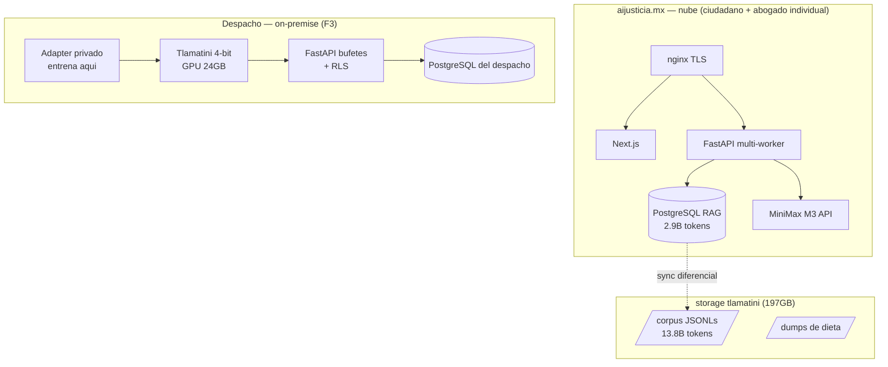

# AI Justicia — Arquitectura del Backend
## Revaloración 2026-09 y plan de evolución al sistema de bufetes

---

## 1. Veredicto ejecutivo

**La fundación es correcta; no se reescribe — se evoluciona.** FastAPI + PostgreSQL nativo + pipeline modular fue la elección acertada y está en producción sosteniendo 2.9B tokens de RAG con streaming SSE. Lo que falta es **estructura para la fase bufete**: el monolito `main.py` (26 endpoints, 783 líneas) necesita partirse en routers, y faltan tres piezas que el spec de bufetes exige: **auth/RBAC, multi-tenancy y cola de trabajos**.

---

## 2. Inventario actual

### Lo sólido (se queda)

| Pieza | Estado | Por qué está bien |
|---|---|---|
| **FastAPI + pydantic-settings** | Producción | Validación de config por entorno, tipado |
| **PostgreSQL nativo** (2 nodos: main RAG / storage NFS 197GB) | 348K docs, 2.9B tokens | FTS español con pesos por fuente; sin dependencia de vector DB externa |
| **Pipeline modular** (7,571 líneas) | 7 etapas desacopladas | query_analysis / expediente / retrieve / generate / verify — cada una testeable |
| **Ingesta idempotente** | 17 fuentes registradas | dedup_key + ON CONFLICT + registro vivo en DB |
| **SSE streaming** | Producción | Entrevista + generación token a token |
| **Trazas** | 55+ evaluaciones | Cada query con pasajes, verificación, timings |

### Lo frágil para lo que viene

| Problema | Riesgo | Solución |
|---|---|---|
| `main.py` monolito (26 endpoints) | Cada módulo nuevo lo engorda; conflictos de merge | **APIRouter por dominio** (ver §3) |
| Sin auth real (frase/dispositivo sin JWT) | No hay RBAC para socios/asociados/pasantes | **JWT + roles por bufete** |
| `bufete_id` como campo suelto | Sin aislamiento verificable inter-bufetes | **RLS (Row-Level Security) de Postgres** |
| Jobs = tabla `pending_jobs` con polling | PII-scans, generación de docs, entrenamiento de adapters necesitan cola real | **Cola Postgres-based (SKIP LOCKED)** — sin Redis, sin nueva infra |
| Uvicorn single-process | Co-edición CRDT necesita websockets | Múltiples workers + ws (cuando llegue F3) |

---

## 3. Evolución: estructura de routers

```
ai_justicia/
├── api/
│   ├── main.py              # solo app assembly + middleware (→ ~100 líneas)
│   ├── deps.py              # auth JWT, sesión DB, tenant actual
│   └── routes/
│       ├── query.py         # /query/stream (existente)
│       ├── dossiers.py      # /dossiers, consentimiento (existente)
│       ├── auth.py          # /auth/* (frase, dispositivo, google → +JWT)
│       ├── admin.py         # /admin/* (stats, harvesters, preguntas)
│       └── bufetes/         # NUEVO — spec de bufetes
│           ├── casos.py     # CRUD casos, timeline, archivado
│           ├── docs.py      # documentos MD, versiones, diff, comentarios
│           ├── biblioteca.py# plantillas, cláusulas, precedentes
│           ├── miembros.py  # invitaciones, roles, permisos
│           └── compliance.py# inventario LFPDPPP, ARDPC, auditoría
├── bufetes/                 # NUEVO — dominio
│   ├── modelos.py           # Caso, Documento, Version, Comentario, Plantilla...
│   ├── store.py             # queries con RLS-forced (SET app.bufete_id)
│   ├── pii_scan.py          # anonimización para promover a plantilla
│   └── gitdocs.py           # git interno por documento
├── pipeline/                # existente, intacto
└── ...
```

**Regla de oro**: cada ruta de bufetes recibe el tenant del JWT y **jamás** acepta bufete_id del cliente — RLS lo garantiza a nivel de fila.

---

## 4. Decisiones técnicas recomendadas

| Decisión | Recomendación | Alternativa descartada | Razón |
|---|---|---|---|
| **Multi-tenancy** | Postgres RLS (`SET app.bufete_id`) | Base por bufete | Una DB por bufete no escala en ops; RLS es verificable y auditable |
| **Cola de trabajos** | Postgres `FOR UPDATE SKIP LOCKED` | Celery+Redis | Ya dependemos de Postgres; cero infra nueva; el jobs/ actual migra directo |
| **Auth** | JWT de vida corta + refresh; roles: socio/associado/pasante | Sessions server-side | On-premise friendly (el bufete controla su secret) |
| **Versionado de documentos** | Git plano por documento (libgit2 via pygit2) | DB-only diffs | Merge real, blame, historial exportable; el bufete puede clonar SU repo |
| **Co-edición** | Yjs + websocket (uvicorn ws) — F3 | OT propio | Maduro, Tiptap-compatible, CRDT offline-first |
| **PII-scan** | Presidio (Apache-2.0) + reglas RFC/ CURP mexicanas propias | NER desde cero | Presidio tiene español; sumamos detectores MX (CURP, RFC, clave elector) |
| **Migraciones** | Alembic (adoptar YA antes de que la schema crezca) | SQL manual | Con bufetes la schema mutará constantemente |

---

## 5. Despliegue por topología



**Invariante de la topología**: el nodo on-premise es **autosuficiente** — si se corta internet, el despacho sigue trabajando (Tlamatini local, RAG local). La nube solo agrega: monitores de reformas, actualizaciones del modelo base, plantillas federales.

---

## 6. Hoja de ruta de refactor (ordenado, sin big-bang)

| Paso | Alcance | Riesgo | Cuándo |
|---|---|---|---|
| R1 | Alembic instalado + schema actual versionada | cero | ya |
| R2 | main.py → routers (mecánico, 26 endpoints) | bajo | F1 bufetes |
| R3 | JWT + deps.py + roles en tablas existentes | bajo | F1 |
| R4 | Tablas bufetes + RLS activada | medio (mig) | F1 |
| R5 | Cola SKIP LOCKED (migra pending_jobs) | bajo | F1 |
| R6 | gitdocs + PII-scan + docs API | medio | F1-F2 |
| R7 | Yjs websocket co-edición | medio | F3 |
| R8 | Empaquetado on-premise (docker-compose despacho) | alto | F3 |

**Regla**: cada paso se despliega independiente y el sistema queda operando tras cada uno. Nada de reescritura congelada.
