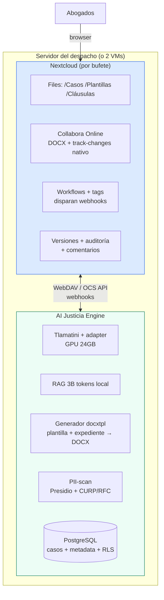

# AI Justicia + Nextcloud + Collabora — El stack soberano de despacho

*v1.0 — Septiembre 2026 · Pivote de editor tras feedback de cliente*

---

## 1. El veredicto

**El cliente tiene razón y el pivote nos hace más fuertes.** Abandonar el editor
Markdown-propio por **Nextcloud + Collabora Online** (el "Euro-Office": LibreOffice en el
navegador) mata el riesgo más grande de nuestra F1 y mejora la historia de soberanía:

1. **Los abogados viven en DOCX con track-changes** — no van a migrar a Markdown. Collabora da
   edición DOCX nativa en browser con control de cambios real, comentarios y co-edición.
   Nuestro editor MD era apostar contra el hábito profesional más arraigado.
2. **Nextcloud ya resuelve** archivos, versiones, permisos, comentarios, búsqueda,
   workflows, usuarios, sincronización móvil/desktop y logs de auditoría — 10+ años de
   madurez que no vamos a reconstruir.
3. **La historia soberana se vuelve más vendible**: Nextcloud (DE/CH) + Collabora (LibreOffice,
   UK) + PostgreSQL + **Tlamatini (MX)** = stack 100% open-source, cero Big Tech americano,
   inmune al CLOUD Act. Es exactamente el stack "Euro-Office" que el cliente pidió.

**Lo que sacrificamos y no extrañamos**: Git-por-documento con branching (concepto de dev, no
de abogado — track-changes + versiones NC es el modelo mental correcto para el gremio).
Markdown queda como formato interno de cláusulas/biblioteca, invisible al usuario.

---

## 2. Topología del despacho (todo on-premise)



**Un Nextcloud por bufete** = multi-tenancy natural e innegociable. En on-premise es la
instancia del despacho; en el tier abogado-individual-cloud, namespace por usuario.

---

## 3. La integración — quién hace qué

### Nextcloud hace (de fábrica)

| Función | Apps NC |
|---|---|
| Edición DOCX colaborativa + track-changes + comentarios | Collabora Online (CODE) |
| Versiones por archivo, restaurar | Files Versions |
| Permisos por carpeta/archivo, grupos | Files Sharing (+ roles socio/asociado/pasante) |
| Búsqueda full-text | Full Text Search (Elasticsearch) |
| Disparadores por tag/evento | Workflows → webhook externo |
| Auditoría, activity stream | Activity + Admin audit |
| OCR de escaneos entrantes | Workflow OCR |
| Sync desktop/móvil, calendarios, Talk | apps estándar |

### AI Justicia hace (nuestro valor)

| Función | Componente |
|---|---|
| **Generar documento** desde plantilla + caso | docxtpl (Jinja2 en DOCX): `{{DENOMINACIÓN}}` rellenado desde expediente → archivo entregado vía WebDAV a `/Casos/{id}/` |
| **Investigación anclada** (Nivel1 + precedentes firma) | Nuestro pipeline; UI como app NC (iframe/external app) o panel lateral |
| **Promover a plantilla** | Workflow NC (tag "promover") → webhook nuestro → PII-scan → copia anonimizada a `/Plantillas/` con track-changes visible para revisión del socio |
| **Monitores de reforma** | Cron diario (ya existe) → alerta NC (notificación + archivo diff en `/Alertas/`) |
| **Router de modelos** (frontera/Tlamatini) | PII-gate clasifica; frontera solo ve lo que sale del perímetro NC anonimizado |
| **Adapter privado** | Entrena leyendo /Plantillas + /Cláusulas + casos con consentimiento (vía API, sin salir del box) |
| **Casos/expediente** (metadata, hechos, timeline, consentimientos) | Nuestro PostgreSQL + RLS; el expediente ENLAZA a carpeta NC del caso |

### Contrato de integración

1. **Estructura de carpetas** gestionada por nosotros vía WebDAV:
   `/Casos/{caso_id}/`, `/Plantillas/{materia}/`, `/Cláusulas/`, `/Alertas/`
2. **Metadatos duales**: NC tiene el archivo; nuestro DB tiene caso↔documento↔versión↔tipo↔
   cláusulas-extraídas. La fuente de verdad del ARCHIVO es NC; del CASO es nuestra DB.
3. **Webhooks NC→Engine**: tag agregada, archivo creado en /Casos, archivo compartido.
4. **Engine→NC**: WebDAV (upload/organizar), OCS API (notificaciones, shares), y app ligera
   para el botón "Generar con Tlamatini" (empezar con external-app iframe; evolucionar a app
   NC propia si hace falta).
5. **Plantillas = DOCX con variables** docxtpl: los socios las editan en Collabora como
   cualquier documento — las `{{VARIABLES}}` son texto visible y auditable.

---

## 4. El flujo estrella (acta constitutiva) — versión Nextcloud

```
Abogado: "Generar acta SA para caso XYZ"
  → nuestro generador: plantilla /Plantillas/Mercantil/acta_SA_v3.docx
    + expediente del caso (denominación, socios, capital)
    → docxtpl → /Casos/XYZ/acta_SA_v1.docx (vía WebDAV)
Abogado la abre en Collabora → ediciones con track-changes
Socio comenta cláusula de administración inline → cambia por
  cláusula de la biblioteca (nuestro panel: 1 click inserta vía docxtpl partial)
v3 final → exporta con logo del despacho (Collabora template de marca)
Caso cierra → tag "promover-plantilla"
  → webhook → PII-scan → /Plantillas/Mercantil/acta_SA_v4.docx
  → el diff de anonimización SE VE como track-changes → socio aprueba
Adapter del bufete re-entrena nocturno con la v4
```

---

## 5. Qué cambia del spec anterior

| Del spec v1 (MD) | A v2 (Nextcloud) |
|---|---|
| Editor MD propio + stylesheet | **Collabora**: DOCX nativo, track-changes real |
| Git interno por documento | **Versiones NC** + nuestra metadata de versiones |
| Comentarios propios | **Comentarios NC** sobre documentos |
| Redline/diff propio (difflib) | **Compare de Collabora** + nuestro diff de cláusulas (biblioteca) |
| Co-edición CRDT (Yjs) F3 | **Co-edición Collabora** (madura) — nos ahorra F3 entera |
| PII-scan (igual) | Igual — ahora también gate del router de modelos |
| Markdown como formato usuario | MD queda **interno** (cláusulas, notas IA); usuario = DOCX |

**Nuevos requerimientos de infra del despacho**: NC (~2-4GB RAM) + Collabora CODE (~4-8GB) +
nuestro engine + GPU. Dimensionamiento: VM de 16GB para NC+CODE+Postgres + box GPU para
Tlamatini, o una máquina de 32GB con GPU. Docker-compose del stack completo = producto.

---

## 6. Riesgos y mitigaciones

| Riesgo | Mitigación |
|---|---|
| Collabora pesado en despachos chicos | CODE community es gratuito; sizing honesto; fallback: solo editar en desktop + NC para archivos |
| Ciclo de versiones NC/Collabora | Pinar versiones en el compose; test de upgrade anual |
| Integración superficial (iframe) al inicio | Los webhooks + WebDAV son profundos de facto; la app NC propia es F2 |
| docxtpl con plantillas complejas (tablas anidadas) | Bien soportado con loops/filtros; casos raros → LibreOffice UNO headless (misma base que Collabora) |
| "Otro sistema más" para el abogado | NC Talk/bot + botón en contexto; el archivo aparece donde él ya trabaja |

---

## 7. Fases revisadas

| Fase | Alcance | Nota |
|---|---|---|
| **F1** | docker-compose despacho (NC+CODE+engine) + generador docxtpl + estructura carpetas + query API básica + PII-scan v1 | MVP instalable en un piloto |
| **F2** | Promoción a plantilla vía workflow+webhook, biblioteca cláusulas, monitores→alertas NC, router de modelos con gate | Con Tlamatini v1 |
| **F3** | App NC propia (panel Tlamatini), adapter entrenamiento en el box, auditoría integrada | Antes era co-edición — ya no la construimos |
| **F4** | Portal cliente (share NC externo), Word add-in opcional, agentic |  |

---

## 8. Decisiones abiertas

1. **App NC**: iframe (rápido) vs app propia Nextcloud (PHP/JS — nuevo stack) — empezar iframe,
   evaluar adopción
2. **docxtpl vs UNO**: docxtpl para 95% de casos; UNO headless como escape hatch (misma
   LibreOffice que Collabora)
3. **Nextcloud vs alternativa**: el cliente dijo Nextcloud — correcto por ecosistema; OnlyOffice
   descartado por origen (Rusia) frente al discurso Euro-soberano
4. **Federación multi-despacho (cloud)**: NC instances por firma vs single-tenant con
   namespaces — on-prem lo resuelve naturalmente

---

## 9. Versionado de documentos (2026-09-05)

**El versionado es nativo de Nextcloud y ya está activo y configurado.** No construimos
nada: `files_versions` versiona automáticamente **cada save de Collabora y cada PUT de
WebDAV** (probado: 3 subidas → 3 versiones en el historial).

### Lo que da NC out-of-the-box (verificado en browser)

| Función | Cómo |
|---|---|
| Versión por cada save | Automática ( Collabora auto-save cada ~30s + cada PUT) |
| Historial con autor y fecha | Sidebar del archivo → tab **Versiones** (en español ✓) |
| Restaurar cualquier versión | Botón de acciones por versión |
| Descargar versión específica | Click en la versión |
| "Versión inicial" y "Versión actual" marcadas | Etiquetas automáticas |

### Configuración aplicada (grado legal)

```
versions_retention_obligation = "auto, 400"   # autos → 400 días (requisito legal laboral)
max_versions_per_file = 0                     # versiones ilimitadas por archivo
```

### Comparación de versiones (redline)

Collabora tiene comparación nativa dentro del editor (Review → Compare), y el sidebar de
NC muestra el historial. Para el diff visual entre dos versiones arbitarias del mismo
documento, `richdocuments` ya integra la vista previa de versiones anteriores. El
diff avanzado entre documentos distintos (p.ej. plantilla v3 vs v4) será via
nuestro servicio con `legal-redline-tools` (fase F2).

### La capa nuestra (lo que NC no da)

| Necesidad del spec | Solución |
|---|---|
| Versión con **mensaje de commit** ("cambió cláusula X por Y") | Nuestro panel puede etiquetar versiones via la API de tags de NC al guardar |
| Diff redline entre 2 versiones arbitrarias | F2: legal-redline-tools en nuestro engine |
| Vincular versión a evento del caso | Nuestra DB casos↔documentos↔versiones con contexto legal |
